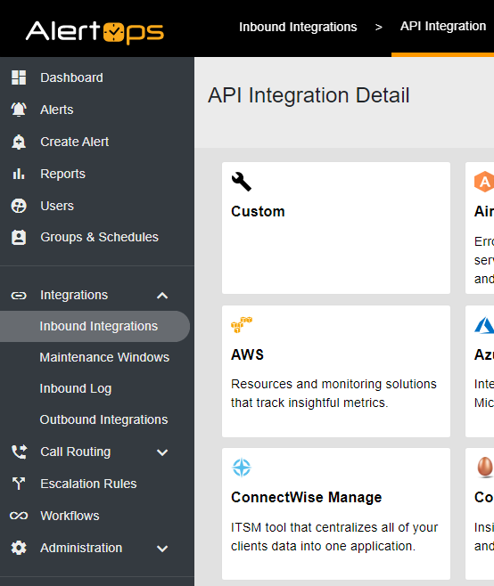

# AlertOps - ConnectWise Manage Integrator

With this Inbound Integration, AlertOps will receive tickets posted to particular boards or all tickets within your environment. It utilizes the ConnectWise Manage API to create your Callbacks for the integration. **Once configured you can fully automate your notifications with ConnectWise Manage and AlertOps!** 

# Directions
***NOTE 1: Please Ensure to Contact support@alertops.com to retrieve the Integration ClientID for AlertOps. In addition ensure to retrieve the Company ID used to login to ConnectWise Manage***
 

***PART 1: Configure your Inbound Integration within AlertOps:***

 1. *Create a new Inbound Integration by choosing the Inbound Integration sub-menu from the Integrations menu. On the API tab (default) select Add API Integration. On the Detail screen, choose ConnectWise Manage.*

 2. *On the resulting page, enter the information, including Integration Name (or keep the default), select an Escalation Rule to define the delivery of notifications, and select a Recipient Group. Press Save and note your Integration URL for use in creating the Callback.*
 

***PART 2: Configure your API Member and Keys within ConnectWise Manage***

Image 2

1. *Create an API Member for AlertOps within ConnectWise Manage. Select the System menu, and from the resulting options, select Members.* 

Image 3

&nbsp;&nbsp;&nbsp;&nbsp;&nbsp;&nbsp;&nbsp;&nbsp;&nbsp;&nbsp;*From the Members page, select the API Members Tab and create a Member for AlertOps and Save*

Image 4

2. *Once you've saved your API Member, navigate to the API Keys Tab. Add new keys and save the values for your public and private keys as soon as they appear. ***Your private key will only be visible once after it is generated.***
 

***PART 3: Download and Run the Integrator Script***

1. *Download the Integrator Script to your Computer and run. You will be prompted to enter the following information*

- Integration Name
- ConnectWise Manage URL up to the version without a backslash at the end: ie. https://staging.connectwisedev.com/v2020_4 
- Private Key 
- Public Key
- ConnectWise Company ID
- Board Name To Integrate
- AlertOps Integration URL
- Integration Client ID

Image 5

2. *Once the information is entered and Next is hit, you should receive a success message that you have created your callback within ConnectWise Manage*

Image 5 
Image 6

***NOTE 2: Once the Script is executed and you receive the notification that the callback has been successfully been created, you can exit the program. When exiting, you will notice an error that states the script did not execute. This is a known issue of the integrator v1.0. You can verify the callback has been created within your ConnectWise Manage environment.***

Image 7

***NOTE 3: This Process Will Create A Callback for the Specified Board. To Send to Multiple Boards, Repeat Execution of the Script for Each Board.***

